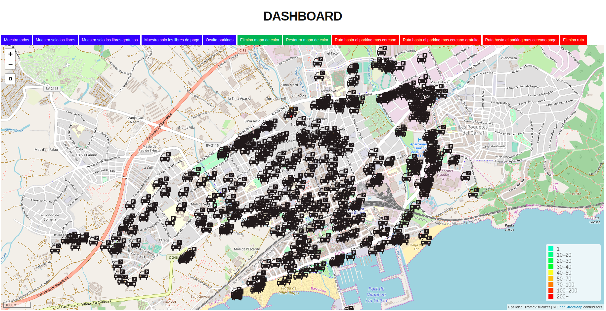
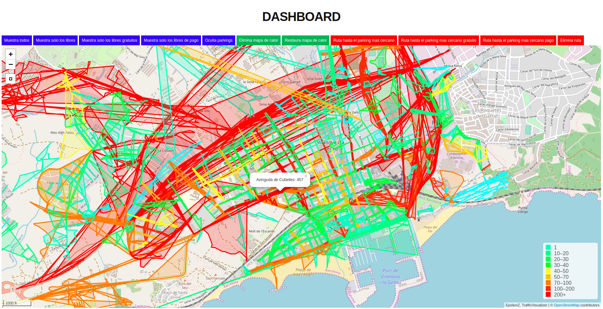

# TrafficVisualizer

In this repo we'll use the traces we've generated from the CityVisualizer (you can see it on my repos) and visualize it with a simple Django App!

What we'll do, before anything, is prepare our OS to have the needed packages.

## REQUIREMENTS

First, you'll have to install python3 if you don't have it:

```
sudo apt-get update
sudo apt-get install python3
```

Once you got python3 installed you will have to install shapely and osmium libraries since we'll play with them

```
pip3 install osmium
pip3 install shapely
```
__Note that pip3 is without sudo!__

And lastly, install django package:

```
pip install django
```

## STEP BY STEP GENERATION

The way this django app is prepared is have a PostgreSQL database prepared with all the required data, and then, when launching the server, it'll do AJAX requests to get the required data at each moment.

To generate the data and insert it to PostgreSQL we just have to execute:

```
python3 init_script.py
```
__NOTE:__ I already provide the trace and the needed data. Later in this README I'll explain to set up your own data.
__NOTE2:__ I'll use mapquest API so if you already have an API KEY perfect! If not just go to mapquest and create one for free.

Once this is executed, you will just have to launch the server. Load the virtual env we have for django:

```
source bin/activate
```

But, before you launch it, you may need to install a last package since we'll use leaflet with django.

```
pip install django-leaflet
```

And then, once it is installed, we will be able to launch our server and play with it!

```
python manage.py runserver 8080
```
__NOTE:__ To join the django-admin you will need to create a supersuser with the command:
```
python manage.py createsuperuser
```

When executing the server, you will be able to access it at localhost:8080 and, then, you will see the following image:



And then, if you click "Restaura mapa de calor" you will be able to see the heatmap that has been generated at the hour you are visualizing it! (__Note that this could be done for each minute of the day but generating this requires a lot of time)__



Note that you see some polygons (heatmaps of each street) that aren't perfectly shaped to the street. That's because the APIs we are using some streets aren't returning good results. But, because we have a graphical interface, we can go back to our files and solve the issue!

